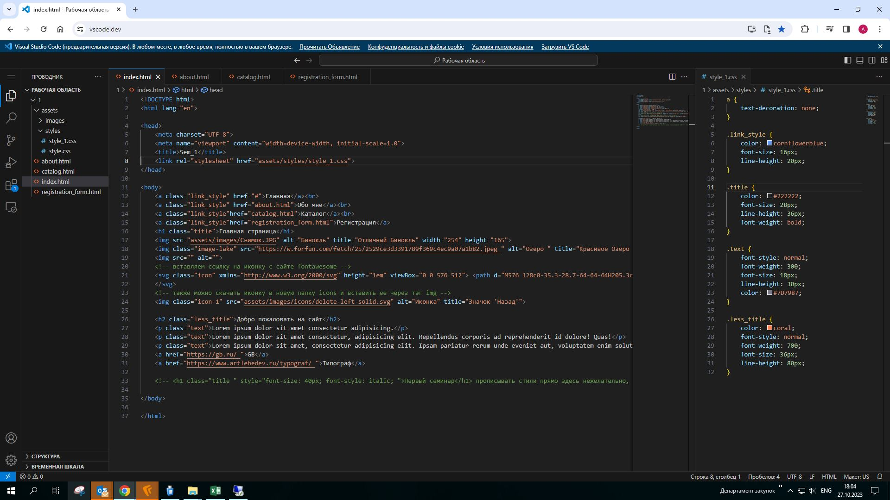

# Урок 4. Семинар. Основы CSS

### Данная домашняя работа является продолжение предыдущей, не забываем использовать работу из прошлого урока

1. Открыть Домашнюю работу из урока 1.

2. Создать файл стилей style.css

3. Подключить ко всем страницам

4. Задать стиль

a {

text-decoration: none;

}

5. Проверить работу стилей на всех страницах.

6. Разделить экран на 2 части, сделать так чтобы файл стилей располагался справа, а все html-файлы были слева.

7. Для всех ссылок меню задать класс (придумать логичное название класса)
* color: cornflowerblue;
* font-size: 16px;
* line-height: 20px;

8. Проверить отображения стилей на всех страницах проекта.

9. Для всех заголовков h1 на сайте задать класс и к нему стиль
* color: #222222;
* font-size: 28px;
* line-height: 36px;
* font-weight: bold;

10. Для всех параграфов в проекте задать класс.

11. К данному классу задать стили:
* font-style: normal;
* font-weight: 300;
* font-size: 18px;
* line-height: 30px;
* color: #7D7987;

12. Для заголовков h2 задать класс.

13. К данному классу указать стиль:
* color: coral;
* font-style: normal;
* font-weight: 700;
* font-size: 36px;
* line-height: 80px;

